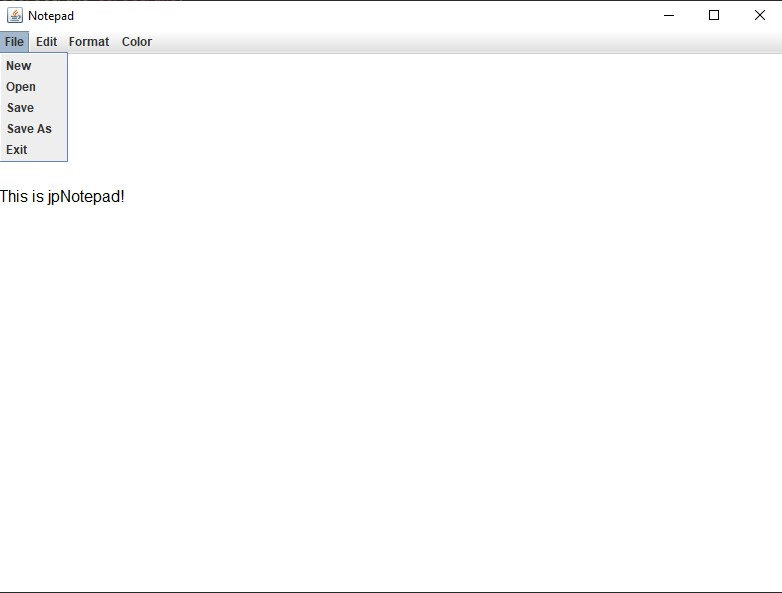

# jpNotepad

jpNotepad is a text editor application implemented in Java. The motivation for this project was to practice Java syntax, object-oriented programming, and the use of Java libraries
such as Java Swing to develop a window-based GUI application. The result is a fully functioning text editing program similar to Microsoft Notepad.

## Installation

1. Install Java 14
2. Git clone this project to your machine
3. Open the project with IntelliJ
4. You may need to set the compiler to include the libraries. If this is the case, use the IntelliJ suggested action to resolve the issues.
5. Open GUI.java and run main

## Implemented Features

* Opening and saving files
* Word wrap
* Undo/redo
* Change text font and size
* Keyboard shortcuts

## Image

## Contributing
Pull requests are welcome. For major changes, please open an issue first to discuss what you would like to change.

Please make sure to update tests as appropriate.
